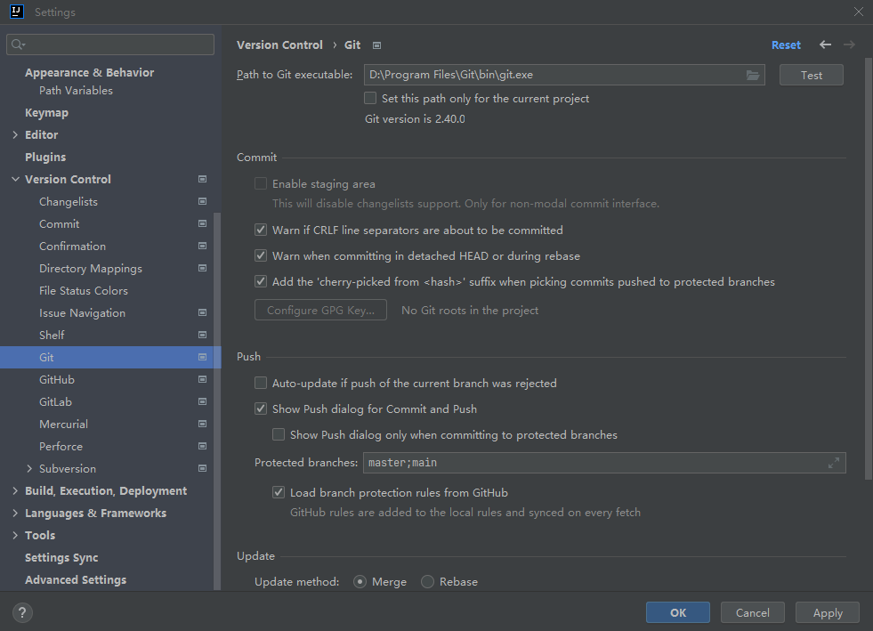

## 代码编写环境
代码编写用的是vscode(前端)和idea(后端)。vscode功能比较强，可以随时添加插件支持不同的语言高亮或测试环境等；idea比较适合java的开发环境。

## github代码仓库
为了把常用的工具串起来还打算用github来进行项目管理。

首先构建项目仓库，项目名为yggycs-Blog，项目属性为公开(public)，添加一个README文件来交代一些环境信息。

## 前后端分离说明
为了更方便地进行项目管理，把前后端分成两个项目，通过外部链接的方式放到同一个项目文件yggycs-Blog中。然后初步的开发过程打算先后端再前端。

## 配置vscode-github开发环境
将github开发集成进vscode，后续只要在vscode中进行项目管理和代码编写！这部分网上的教程其实很乱，之前一直没搞清楚，这次正好跑通然后记录一下。

首先先解决一下github密钥问题，然后可以通过ssh来连接github项目。

在任意目录下右键然后点Git Bash Here，输入cd ~/.ssh进入存放ssh密钥的目录，然后输入ls，就可以看到本地是否存在密钥(id_rsa和id_rsa.pub)。没有密钥要先生成，这里我电脑上之前被我搞过，是有个密钥的。然后输入命令cat id_rsa.pub打开公钥，把公钥内容复制到github的setting里。加完以后可以在bash中输入ssh -T git@github.com来验证是否成功。然后就发现失败了，笑死。

开始debug，报错信息大概是"IT IS POSSIBLE THAT SOMEONE IS DOING SOMETHING NASTY!
Someone could be eavesdropping on you right now (man-in-the-middle attack)!
It is also possible that a host key has just been changed."，这是因为没有删除本地的host_known文件，删除后重新验证就成功连上ssh啦~

ssh解决以后就可以开始将github与vscode连接起来了。

首先在D盘中新建一个文件夹，就叫Repositories好了，然后进入这个文件夹，右键点击Git Bash Here。输入命令git init。然后先将新建的yggycs-Blog项目档到本地。输入命令git clone git@github.com:yggycs/yggycs-Blog.git，把项目档到本地，用vscode打开档下来的yggycs-Blog文件夹。然后在右侧源代码管理可以建立本地文件夹和仓库的关联。

将开发文档文件夹加到yggycs-Blog里面。然后在vscode中尝试提交此次更改。然后就可以在github的项目里看到提交的开发文档文件夹了！到这里就完成了开发环境的配置，后续在这个文件夹中用vscode进行代码的编写，然后使用源代码管理就可以用github进行项目管理了！

前端项目也用vscode作为ide，步骤类似，这里就不多赘述了。

## 配置IDEA-github开发环境
后端项目使用IDEA作为ide。

首先配置一下idea内git的路径，File-Settings-Version Control-Git，输入合适的路径，点旁边的Test，如果能识别到git的版本信息应该就是成功了。Apply一下对应的修改结果。

接下来要绑定一下github的账号，File-Settings-Version Control-GitHub，在线登录github验证一下就行。

打开IDEA的项目管理(version control)，发现报了一个错"fatal:detected dubious ownership in repository..."，按照错误提示把文件夹设置成信任的文件夹就可以了。

修改完README.md文件后，文件会变蓝，同时项目管理(version control)中会显示修改的文件列表，commit后push即可。