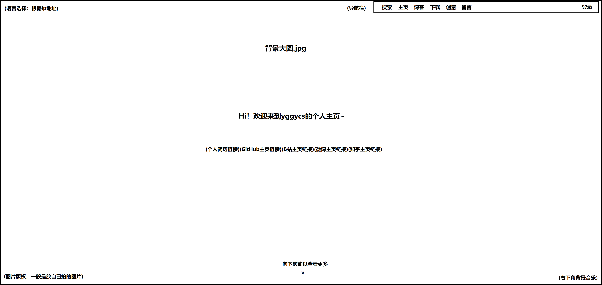

## 技术目标
希望能通过这个摸鱼项目走一趟前后端流程，多掌握一个网页设计的技能吧，技多不压身嘛，然后就用周末来所里摸鱼的时间搞搞，省得在家里摸鱼发烂发臭qaq。

然后这个项目应该会是一个完整的前后端流程，会包括前端（基于vue，语言html+css+js），后端（mysql数据库和用go/java语言来开发），为了做成一个前后端的项目，应该会把功能做得花一点，然后预计开发时间是半年期，因为想要follow一下ysyx，后续会作为一个博客方便自己把笔记放到上面做分享或者做留存，然后可以后面在上面写写算法题思路、分享分享论文笔记啥的，甚至可以付费查看某些内容哈哈哈哈哈哈哈哈哈哈哈哈哈哈哈哈哈哈哈（想屁吃）

## 网站构思（随做随改）
包括一个登录逻辑！登陆类型应该有管理者（我！）、俺的朋友们（相当于vip用户！）还有普通用户。登陆只是一个强行加的功能，一般登录是为了有个账号能够留言或者评论，实际上有没有登录逻辑对于个人网站来说没啥太多的区别，然后为了防止攻击或者白嫖爬虫啥的，不登陆应该会限制评论、下载、查看完整文章等的功能

然后要做一个首页，首页上有导航条，导航条上有博客功能、留言板功能、资料下载功能、登录功能和注册功能吧，然后背景搞个大图啥的可以展示一下自己拍的好看的照片，然后还要有几个外链接，比如github.io的简历链接、github主页链接等等吧，可以先把github.io搞了，反正以后也需要搞。

博客的话可以参考一般博客网站长啥样，然后抄抄就可以了，管理者支持博客在线编辑功能吧，可以参考知乎写文章的那个样子，然后支持md格式导出，因为我自己本地也要存一份，防止丢失，或者我想的就是本地写完以后直接以md格式上传。然后博客结束的地方厚脸皮地贴个收款码吧哈哈哈哈哈哈哈哈哈哈哈哈哈哈哈哈哈哈不愧是我

留言板应该就很像qq空间那种，然后有空可以搞搞什么签到系统之类的，有不同铭牌的那种哈哈哈哈

资料下载搞个导航之类的，这个后面再说

## 首页构思
(2023.10.23更新)因为要设计数据库了所以稍微具体化了一下前端的构思，简单画了一个首页的示意图。

