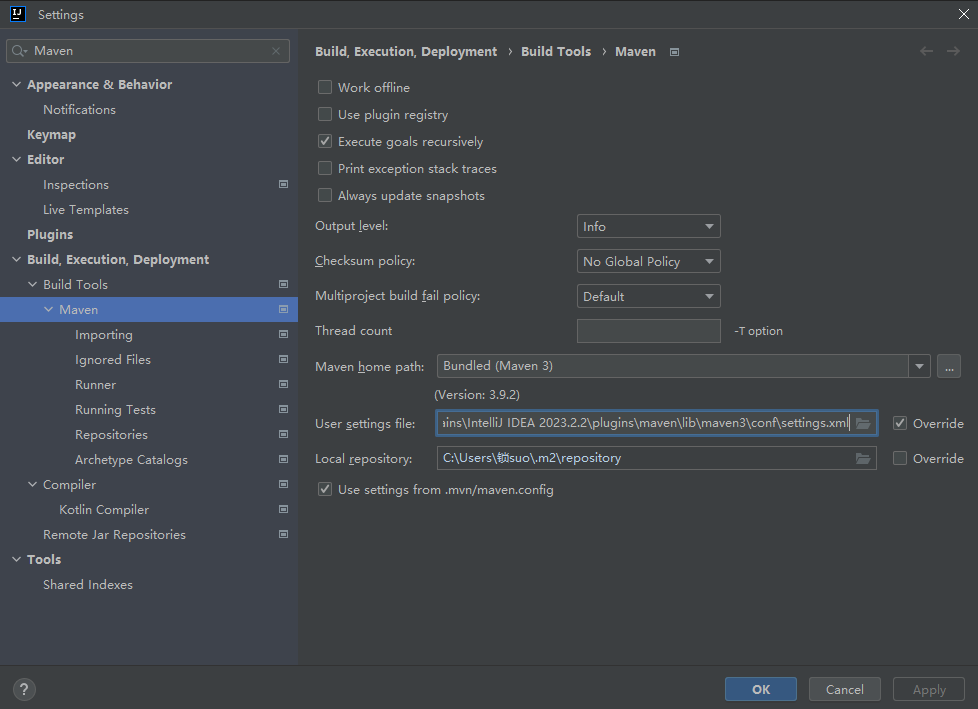
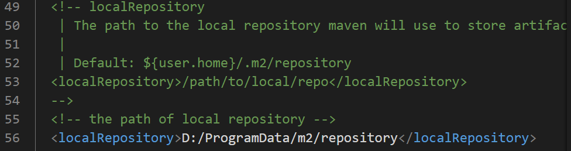
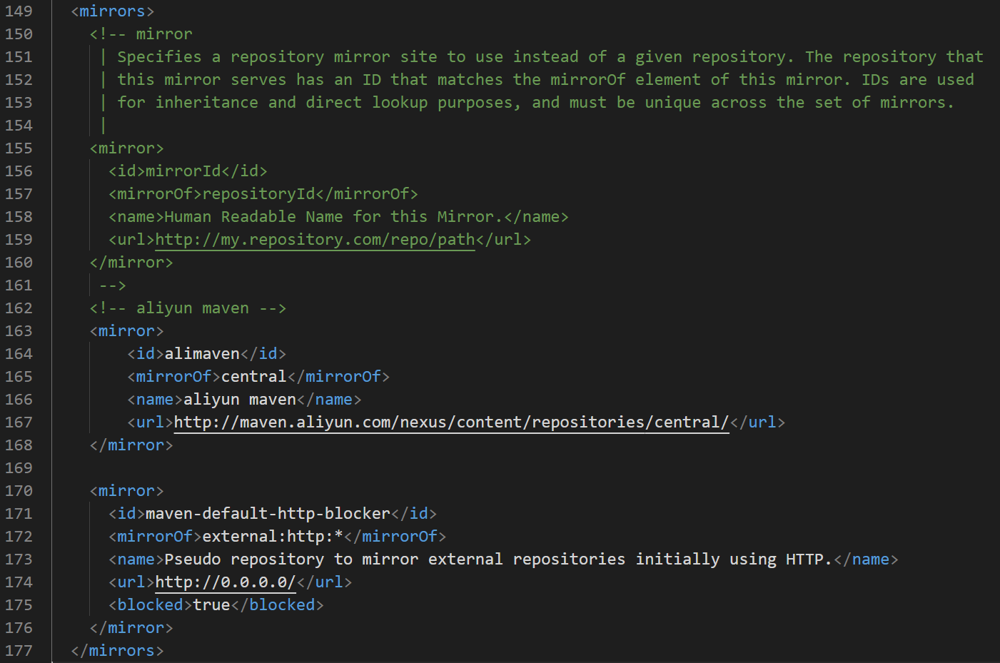
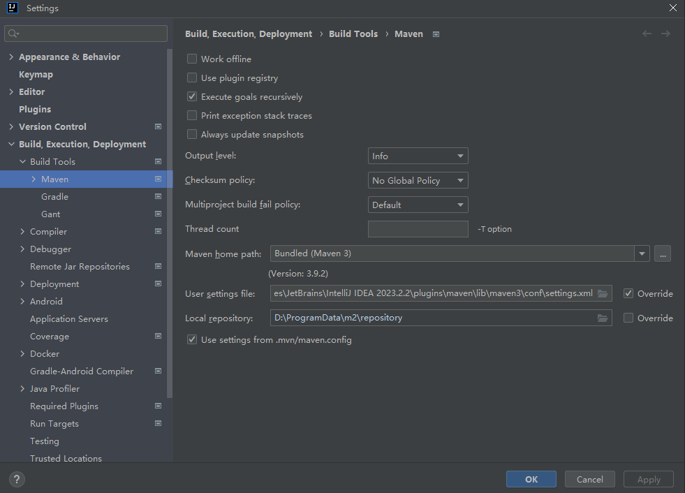

## Maven
Maven是一个项目管理工具，主要用于Java项目的构建。本项目中后端开发使用Maven进行项目管理，由于IDEA中直接集成了Maven工具，所以直接通过IDEA创建Maven项目即可。
### 查看IDEA中的Maven设置
File-Settings-搜索Maven，可以看到Maven的一些配置信息，然后修改Maven路径、Maven配置文件路径，如下图所示，这里Maven仓库路径暂时没有修改，后续在settings.xml中修改。修改后点击Apply。

### 调整Maven编译时jar包的下载位置
将Maven仓库位置修改在空间更大的D盘中。打开settings.xml，在其中添加如下图所示的代码，指定新的Maven仓库位置为D:\ProgramData\m2\repository。

### 更换Maven编译时jar包的下载源
将Maven下载源换为国内镜像源，加快jar包下载速度。打开settings.xml，在其中添加如下图所示的代码，添加新的Maven镜像源(阿里云镜像)。

完成以上配置后再次打开，如下图所示，可以看到Maven的仓库路径自动识别了。至此完成了IDEA中的Maven配置。

## Docker
Docker是代码移植、部署工具，linux开发环境下使用较方便，所以本地安装配置时暂时不考虑Docker，等到租云服务器，将后端部署到云端的时候再来学习。(坑待填)

## SpringBoot

## Mybatis

## Mysql

## Redis

## H2

