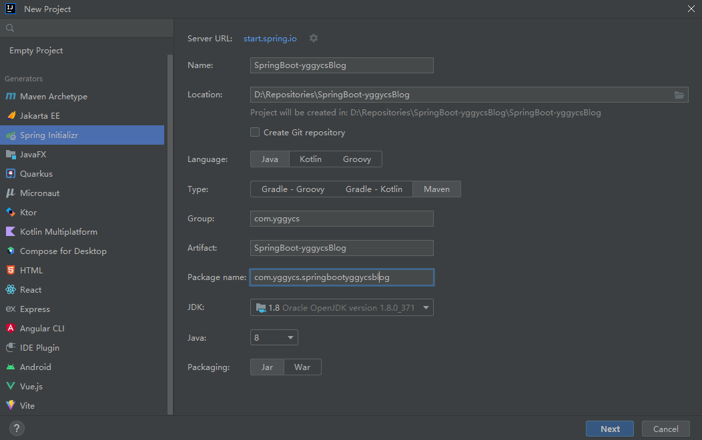
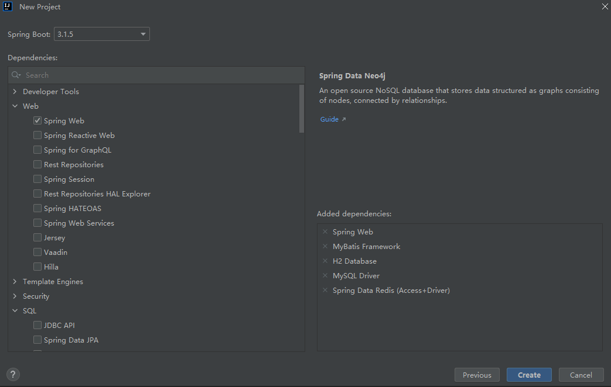
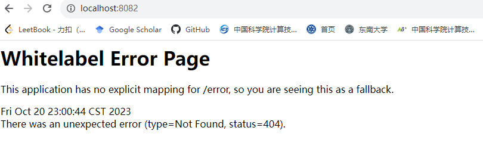

## 新建工程
首先打开IDEA，File-New-Project，在弹出的界面框中选择Spring Initializr，然后选择或输入相关项目信息，如下图所示，点Next。

然后选择对应的依赖，首先选择一些目前想到的依赖：Spring Web、MyBatis、Redis、Mysql、H2，如下图所示，后续需要的话应该可以在pom.xml中再加。点击Create。

## HelloWorld
基本操作如上一节所述，实际上这里省略一堆关于idea内maven版本配置、依赖版本配置、端口修改配置等一堆debug过程(递归bug)，成功跑起来了空项目，在浏览器中输入localhost:8082，可以看到如下图所示的提示信息。到这里就说明基本配置应该没问题了，下面需要逐步配置或者使用mybatis、mysql、h2、redis和写相关业务。

