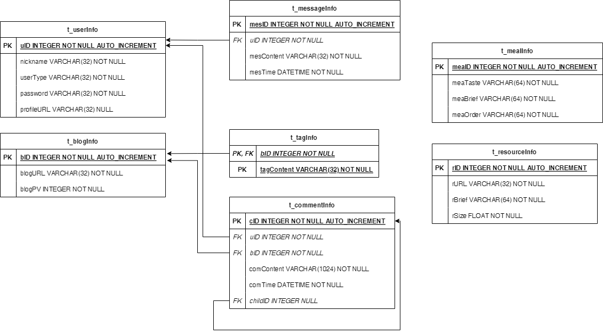

## 业务需求简介
大概的业务需求看首页的设计基本上能够确定了，这个可能后面会迭代，但是大概不会大改。


目前能想到的业务有：用户登录、用户注册、用户评论、用户下载、用户浏览博客、用户留言等等，先根据这些信息来浅浅设计一下表。

## 数据库表设计
根据业务需求，可以抽象出如下所示的实体信息。

用户(user)：**用户ID**、用户昵称、用户类型(管理员、vip用户、普通用户)、用户密码、用户头像url

博客(blog)：**博客ID**、博客url、博客访问量

博客标签(tag)：**博客ID**、**标签内容**

评论(comment)：**评论ID**、评论者ID、被评论博客ID、评论内容、评论时间、子评论ID

留言(message)：**留言ID**、留言者ID、留言内容、留言时间

菜(meal)：**菜ID**、菜风味、菜简介、菜获取方式

资源(resource)：**资源ID**、资源url、资源简介、资源大小

### 用户表(t_userInfo)
用户表的数据模式描述如下表所示：

| 属性名称 | 属性类型 | 键信息 | 备注 |
| :----:  | :----:  | :----: | :----: |
| uID | INTEGER | 主键 | 用户ID |
| nickname | VARCHAR(32) | | 用户昵称 |
| userType | VARCHAR(32) | | 用户类型(管理员、vip用户、普通用户) |
| password | VARCHAR(32) | | 用户密码 |
| profileURL | VARCHAR(32) | | 用户头像url |

建表语句如下：

``` sql
    CREATE TABLE IF NOT EXISTS t_userInfo(
        uID INTEGER NOT NULL AUTO_INCREMENT,
        nickname VARCHAR(32) NOT NULL,
        userType VARCHAR(32) NOT NULL,
        password VARCHAR(32) NOT NULL,
        profileURL VARCHAR(32) NULL,
        PRIMARY KEY (uID)
    );
```

### 博客表(t_blogInfo)
博客表的数据模式描述如下表所示：

| 属性名称 | 属性类型 | 键信息 | 备注 |
| :----:  | :----:  | :----: | :----: |
| bID | INTEGER | 主键 | 博客ID |
| blogURL | VARCHAR(32) | | 博客url |
| blogPV | INTEGER | | 博客访问量 |

建表语句如下：

``` sql
    CREATE TABLE IF NOT EXISTS t_blogInfo(
        bID INTEGER NOT NULL AUTO_INCREMENT,
        blogURL VARCHAR(32) NOT NULL,
        blogPV INTEGER NOT NULL,
        PRIMARY KEY (bID)
    );
```

### 博客标签表(t_tagInfo)
博客标签表的数据模式描述如下表所示：

| 属性名称 | 属性类型 | 键信息 | 备注 |
| :----:  | :----:  | :----: | :----: |
| bID | INTEGER | 主键、外键 | 博客ID |
| tagContent | VARCHAR(32) | 主键 | 标签内容 |

建表语句如下：

``` sql
    CREATE TABLE IF NOT EXISTS t_tagInfo(
        bID INTEGER NOT NULL,
        tagContent VARCHAR(32) NOT NULL,
        PRIMARY KEY (bID, tagContent),
        FOREIGN KEY (bID)
        REFERENCES t_blogInfo(bID)
        ON DELETE RESTRICT
    );
```

### 评论表(t_commentInfo)
评论表的数据模式描述如下表所示：

| 属性名称 | 属性类型 | 键信息 | 备注 |
| :----:  | :----:  | :----: | :----: |
| cID | INTEGER | 主键 | 评论ID |
| uID | INTEGER | 外键 | 评论者ID |
| bID | INTEGER | 外键 | 被评论博客ID |
| comContent | VARCHAR(1024) | | 评论内容 |
| comTime | DATETIME | | 评论时间 |
| childID | INTEGER | 外键 | 子评论ID |

建表语句如下：

``` sql
    CREATE TABLE IF NOT EXISTS t_commentInfo(
        cID INTEGER NOT NULL AUTO_INCREMENT,
        uID INTEGER NOT NULL,
        bID INTEGER NOT NULL,
        comContent VARCHAR(1024) NOT NULL,
        comTime DATETIME NOT NULL,
        childID INTEGER NULL,
        PRIMARY KEY (cID),
        FOREIGN KEY (uID)
        REFERENCES t_userInfo(uID)
        ON DELETE RESTRICT,
        FOREIGN KEY (bID)
        REFERENCES t_blogInfo(bID)
        ON DELETE RESTRICT,
        FOREIGN KEY (childID)
        REFERENCES t_commentInfo(cID)
        ON DELETE RESTRICT
    );
```

### 留言表(t_messageInfo)
留言表的数据模式描述如下表所示：

| 属性名称 | 属性类型 | 键信息 | 备注 |
| :----:  | :----:  | :----: | :----: |
| mesID | INTEGER | 主键 | 留言ID |
| uID | INTEGER | 外键 | 留言者ID |
| mesContent | VARCHAR(32) |  | 留言内容 |
| mesTime | DATETIME |  | 留言时间 |

建表语句如下：

``` sql
    CREATE TABLE IF NOT EXISTS t_messageInfo(
        mesID INTEGER NOT NULL AUTO_INCREMENT,
        uID INTEGER NOT NULL,
        mesContent VARCHAR(32) NOT NULL,
        mesTime DATETIME NOT NULL,
        PRIMARY KEY (mesID),
        FOREIGN KEY (uID)
        REFERENCES t_userInfo(uID)
        ON DELETE RESTRICT
    );
```

### 菜表(t_mealInfo)
菜表的数据模式描述如下表所示：

| 属性名称 | 属性类型 | 键信息 | 备注 |
| :----:  | :----:  | :----: | :----: |
| meaID | INTEGER | 主键 | 菜ID |
| meaTaste | VARCHAR(64) |  | 菜风味 |
| meaBrief | VARCHAR(64) |  | 菜简介 |
| meaOrder | VARCHAR(64) |  | 菜获取方式 |

建表语句如下：

``` sql
    CREATE TABLE IF NOT EXISTS t_mealInfo(
        meaID INTEGER NOT NULL AUTO_INCREMENT,
        meaTaste VARCHAR(64) NOT NULL,
        meaBrief VARCHAR(64) NOT NULL,
        meaOrder VARCHAR(64) NOT NULL,
        PRIMARY KEY (meaID)
    );
```

### 资源表(t_resourceInfo)
资源表的数据模式描述如下表所示：


| 属性名称 | 属性类型 | 键信息 | 备注 |
| :----:  | :----:  | :----: | :----: |
| rID | INTEGER | 主键 | 资源ID |
| rURL | VARCHAR(32) |  | 资源url |
| rBrief | VARCHAR(64) |  | 资源简介 |
| rSize | FLOAT |  | 资源大小 |

建表语句如下：

``` sql
    CREATE TABLE IF NOT EXISTS t_resourceInfo(
        rID INTEGER NOT NULL AUTO_INCREMENT,
        rURL VARCHAR(32) NOT NULL,
        rBrief VARCHAR(64) NOT NULL,
        rSize FLOAT NOT NULL,
        PRIMARY KEY (rID)
    );
```

## 数据库E-R图
将建表语句导入draw.io，生成的ER图如下图所示。[ER图源文件](./figure/ER图/ERpic.drawio)



## 数据访问层DAO设计